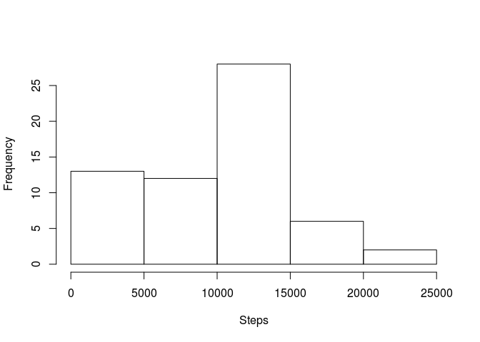
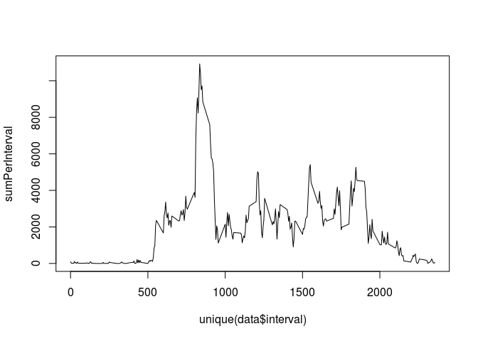

# Reproducible Research: Peer Assessment 1


## Loading and preprocessing the data


```r
rawData <- read.csv("activity.csv")
data <- rawData[complete.cases(rawData),]
```

## What is mean total number of steps taken per day?


```r
hist(sapply(levels(data$date), function(l) {sum(subset(data, date == l)[,1])} ), main = "", xlab = "Steps")
```

 

```r
mean(sapply(levels(data$date), function(l) {sum(subset(data, date == l)[,1])} ))
```

```
## [1] 9354.23
```

```r
median(sapply(levels(data$date), function(l) {sum(subset(data, date == l)[,1])} ))
```

```
## [1] 10395
```

## What is the average daily activity pattern?


```r
sumPerInterval <- sapply(unique(data$interval), function(i) {sum(subset(data, interval == i)[,1])})
plot(unique(data$interval), sumPerInterval, type = "l")
```

 

```r
which(sumPerInterval == max(sumPerInterval))
```

```
## [1] 104
```

## Imputing missing values


```r
sum(!complete.cases(rawData))
```

```
## [1] 2304
```

Using mean for the day to fill in missing values


```r
missingData <- rawData[!complete.cases(rawData),]
x <- sapply(levels(missingData$date), function(l) {mean(subset(data, date == l)[,1])} )
x[is.nan(x)] <- 0
library(sqldf)
```

```
## Loading required package: gsubfn
## Loading required package: proto
## Loading required package: RSQLite
## Loading required package: DBI
```

```r
for(i in seq(1, length(x))) {
  name <- names(x[i]);
  step <- x[i];
  rawData <- fn$sqldf(c("update rawData set steps = $step where date like '$name' and steps is null", "select * from main.rawData"));
}
```

```
## Loading required package: tcltk
```

```r
hist(sapply(levels(rawData$date), function(l) {sum(subset(rawData, date == l)[,1])} ), main = "", xlab = "Steps")
```

 

```r
mean(sapply(levels(rawData$date), function(l) {sum(subset(rawData, date == l)[,1])} ))
```

```
## [1] 9354.23
```

```r
median(sapply(levels(rawData$date), function(l) {sum(subset(rawData, date == l)[,1])} ))
```

```
## [1] 10395
```
What is the impact of imputing missing data on the estimates of the total daily number of steps?


```r
sumPerInterval <- sapply(unique(rawData$interval), function(i) {sum(subset(rawData, interval == i)[,1])})
plot(unique(rawData$interval), sumPerInterval, type = "l")
```

 

```r
which(sumPerInterval == max(sumPerInterval))
```

```
## [1] 104
```

```r
sum(data$steps)
```

```
## [1] 570608
```

```r
sum(rawData$steps)
```

```
## [1] 570608
```

## Are there differences in activity patterns between weekdays and weekends?
